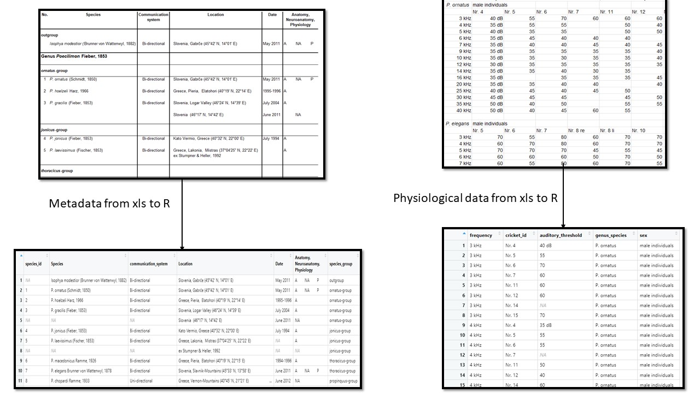
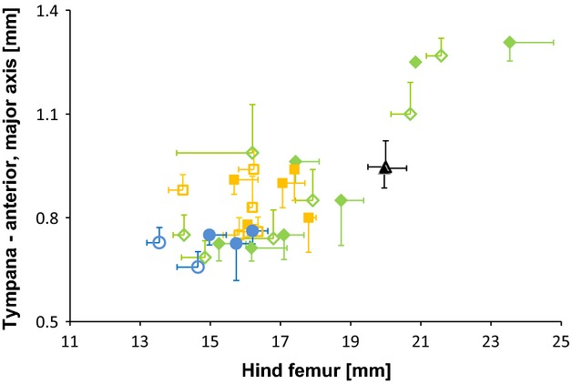

---
title:
  Sensory evolution of hearing in tettigoniids with differing communication
  systems
subtitle: "Group 10"
output: ioslides_presentation
author: "Adresya Azhakath, Filip Uzdowski, Mikkel Wolfhagen, Nilas Schüsler"
date: "2022-05-02"
---

```{r setup, include=FALSE}
knitr::opts_chunk$set(echo = FALSE)
```

<style>
.forceBreak { -webkit-column-break-after: always; break-after: column; }
</style>

## Background

<div class="columns-2">

<font size = "4">   

- The paper explores the consequences of communication strategies on adaptive sensory features. 

- Morphology, neuroanatomy and hearing sensitivity

- Uni and bi-directional species

- **Hypothesis:** In bi-directional species selection favours high sensitivity, larger hearing structures and increased sensillae counts. 
</font>

<p class="forceBreak"></p>

```{r}
knitr::include_graphics(path = "../doc/images/insect_auditory.jpg")
```
<font size = "2"> **Auditory anatomy of tettigonoids**    
as - auditory spiracle, at - auditory trachea, ty - tympana   
</font>
<font size = "0.5"> *(Strauss, Lehmann and Lehmann, 2013)* </font>

</div>

## Material used for our analysis

<font size = "4"> 
<div class="columns-2">
- Characteristics of the auditory system for functional adaptations analysed:
  (i) Dimension of sound-receiving structures
  (ii) Number of auditory sensilla
  (iii) Hearing sensitivity
- Fifteen species selected for morphometric analysis of auditory structures
- Neuroanatomy and hearing sensitivity investigated in subset of five selected species
- Animals collected at locations in Greece, Slovenia and the Czech Republic 
- Specimens for anatomical measurements collected between 1994 and 1996 and stored in ethanol
- Specimens for neuroanatomical and physiological experiments collected in May/June 2011 and June 2012

</font>
<p class="forceBreak"></p>
<center>
  {width=470px}
</center>
</div>
## Material used for our analysis

<font size = "4"> 

- List of individuals studied from the genus Poecilimon and the out-group genus Isophya(Table  S1)

- *JEvolBiol_Sensory evolution Poecilimon_Database*
Includes the data from morphometric measurements on structures of the auditory system in different Poecilimon tettigoniids and the data from physiological measurements of hearing thresholds.
</font>

<center>
```{r}
knitr::include_graphics(path = "../doc/images/Database.jpg")
```
</center>

## Methods


## Loading the datasets
```{r, out.width="90%", fig.align='center'}

```

## Morphological results

- Spiracle size correlated with communication system

- Tympana scales with body size

- Sensilla number highest for bidirectional species

<center>
  {width=380px}
  {width=380px}
</center>

## Alternative morphological plot
<center>
  {width=720px}
</center>

## Auditory threshold vs frequency plot
```{r, out.width="100%", fig.align='center'}
knitr::include_graphics("../results/06_auditory_threshold_vs_frequency_plot.svg")
```

## PCA

```{r, fig.show = "hold", out.width="50%"}
knitr::include_graphics(c("../results/05_contribution_plot_plot.svg",
                          "../results/05_scree_plot_plot.svg"))
```

- not all variables used due to missing values

- size and tympana but not spiracle length correlated 

- spiracle length larger in bi-directional species

## PCA

```{r, out.width="95%", fig.align='center'}
knitr::include_graphics(c("../results/05_biplot_plot.svg"))
```


## Clustering

- 5 clusters one for each species

<center>
  {width=620px}
</center>

## Discussion

- PCA 

- Alternative plot

- Limitations